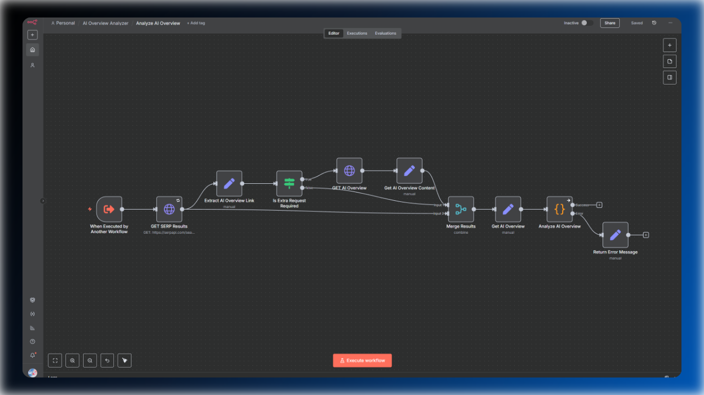

# AI-Powered Analysis of Google's AI Overviews

This n8n workflow acts as a specialized AI agent that analyzes Google's AI Overviews. It provides a detailed blueprint on how to structure your content to be featured as a top reference. By parsing and analyzing the AI-generated answer, this agent reveals the key topics, entities, and sources Google's AI trusts, giving you a strategic advantage in content creation.

### Key Features

*   **In-Depth AI Overview Analysis:** Fetches and analyzes the AI Overview for any given search query and country, giving you insight into what Google's AI considers most relevant and authoritative.
*   **Source & Reference Identification:** Identifies the top-ranking sources and analyzes how they are referenced within the AI-generated answer.
*   **Topic & Entity Extraction:** Extracts the crucial topics, questions, and entities that your content must cover to be considered comprehensive.
*   **Content Blueprint Generation:** Creates a report that serves as a strategic blueprint for writing new content that is perfectly aligned with what Google's AI is looking for.

### Prerequisites

Before you begin, ensure you have the following accounts and credentials set up. This workflow relies on external services to gather the necessary data.

*   **OpenAI API Key:** A valid API key from OpenAI. The agent was tested with the `GPT-4.1` model.
*   **SerpApi API Key:** An API key from [SerpApi.com](https://serpapi.com/).
    *   **What it's used for:** This tool provides structured JSON data from live Google Search results. It is essential for reliably fetching the AI Overview, including its content, sources, and references. The workflow is built to handle cases where a second request is needed to load the full AI Overview, which SerpApi facilitates.
    *   

### How to use it

1.  **Import the Workflows:** Download the workflow `.json` files and import them into your n8n instance.
2.  **Configure Credentials:** Add your API keys for OpenAI and SerpApi to the corresponding credential fields in the workflow.
3.  **Chat with the Agent:** Simply provide a specific query along with the desired target country. For local SEO, you can also specify a location by using trigger words such as `location` or `city`.
4.  **Review the Blueprint:** Once the workflow completes, the agent will return a detailed report that acts as a blueprint for your content creation process.

### Example Output

The workflow generates a comprehensive markdown report that includes:

*   **Content Structure Blueprint:** A recommended structure for your article, including potential headings and subheadings based on the AI Overview.
*   **Key Topics and Entities:** A list of must-have topics, questions, and entities to include in your content to ensure it's comprehensive.
*   **Source Analysis:** A summary of the top sources used by the AI Overview and insights into why they were likely chosen.
*   **Key Action Summary:** A concise, bulleted list of the most critical actions to take when creating your new content.

### How to get the most out of this agent

While chatting with an AI Agent is useful, it is not fully automated and still costs valuable time. I would recommend incorporating this Agent into content optimization and creation workflows as an additional source of real-time data. As an example, you could use this agent in my [AI SEO Writer](../gsc-ai-seo-writer/readme.md) template.

This means the workflow would not only have access to your performance data from Google Search Console, but also to accurate data about the sources being used to generate the AI answers.
