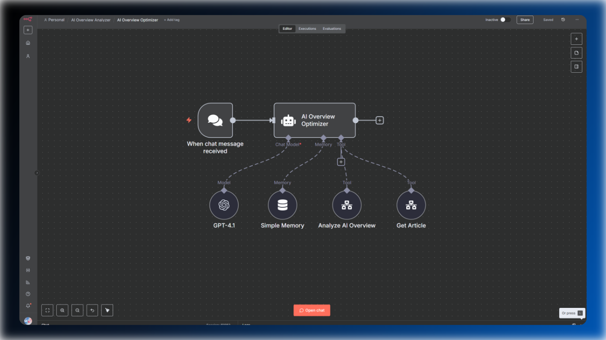

# AI-Powered Content Optimization for Google's AI Overviews

This SEO AI agent is designed to analyze Google's AI Overviews. It provides concrete, actionable recommendations to get your content featured as a top reference. By strategically comparing your webpage against the data used in AI-generated answers, this agent pinpoints content gaps and suggests specific enhancements to increase the chance of being used as a reference source in AI-generated answers.

🎥 **Watch the Demo:** For a complete walkthrough of this workflow, check out the [YouTube video](https://youtu.be/sMznan79ox8?si=ODZBPA42mbz3z8sz).

### Key Features

*   **AI Overview Analysis:** Fetches and dissects the AI Overview for any given search query and country, giving you insight into what Google's AI deems most relevant and authoritative.
*   **On-Page Content Scraping:** Scrapes and processes the content of your target URL to perform a comprehensive, side-by-side analysis.
*   **Content Gap Identification:** Compares your content with the AI Overview to identify missing topics, entities, and information that are crucial for being included as a reference.
*   **Actionable Recommendations:** Generates a detailed report with optimized titles, meta descriptions, and ready-to-use, copy-paste content suggestions to enhance your existing articles.
*   **No Access Required:** This entire process works with any live URL, meaning you don't need access to Google Search Console or any other backend system to optimize your page.

### Prerequisites

Before you begin, ensure you have the following accounts and credentials set up. This workflow relies on two key external services to gather the necessary data.

*   **n8n:** An active n8n instance (local or cloud).
*   **OpenAI API Key:** A valid API key from OpenAI. The agent was tested with the `GPT-4.1` model.
*   **Serper API Key:** An API key from [Serper.dev](https://serper.dev/). (Need help setting up the credential in n8n? [Watch this guide](https://youtu.be/SFI-cyoKnKs)).
    *   **What it's used for:** While primarily a SERP API, this workflow uses Serper's efficient and affordable `/scraper` endpoint. It reliably extracts the main content, title, and meta description from any URL and returns it in a clean markdown format, which is perfect for AI analysis.
    *   
*   **SerpApi API Key:** An API key from [SerpApi.com](https://serpapi.com/).
    *   **What it's used for:** This tool provides structured JSON data from live Google Search results. It is essential for reliably fetching the AI Overview, including its content, sources, and references. The workflow is built to handle cases where a second request is needed to load the full AI Overview, which SerpApi facilitates.
    *   

### How to use it

1.  **Import the Workflows:** Download the workflow `.json` files and import them into your n8n instance.
2.  **Configure Credentials:** Add your API keys for OpenAI, Serper, and SerpApi to the corresponding credential fields in the workflow.
3.  **Chat with the Agent:** Simply provide a specific query along with the desired target country. For local SEO, you can also specify a location by using trigger words such as `location` or `city`.
4.  **Review the Report:** Once the workflow completes, the agent will return a detailed report with actionable recommendations to improve your content.

### Example Output

The workflow generates a comprehensive markdown report that includes:

*   **Optimized Title and Meta Description:** Suggestions for a more compelling title and meta description, tailored to the AI Overview's focus.
*   **Content Gap Analysis:** A clear breakdown of the topics, questions, and entities covered in the AI Overview that are missing from your page.
*   **Specific Content Enhancements:** Copy-paste examples of new paragraphs and sentences to seamlessly integrate into your content.
*   **Key Action Summary:** A concise, bulleted list of the most critical actions to take to improve your chances of being featured.

### How to get the most out of this agent

While chatting with an AI Agent is useful, it is not fully automated and still costs valuable time. This agent works out of the box, as long as you provide the `URL` and search parameters. This means you can easily use this SEO Agent to extend your content optimization or creation workflows. 

As an example, you could integrate this Agent with my [AI SEO Writer](../gsc-ai-seo-writer/readme.md) (also free) to easily add real-time data alongside accurate data from your Google Search Console.
