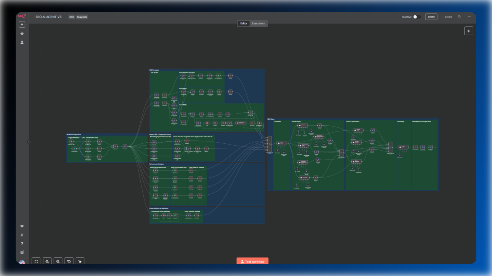
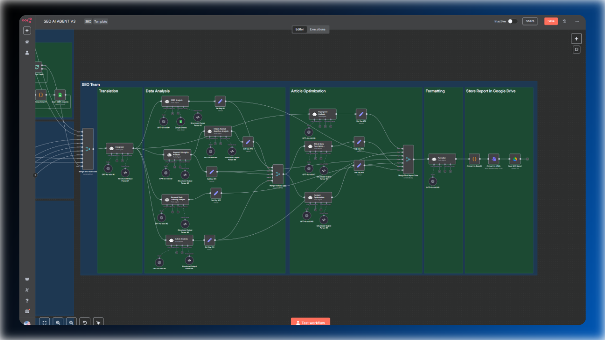
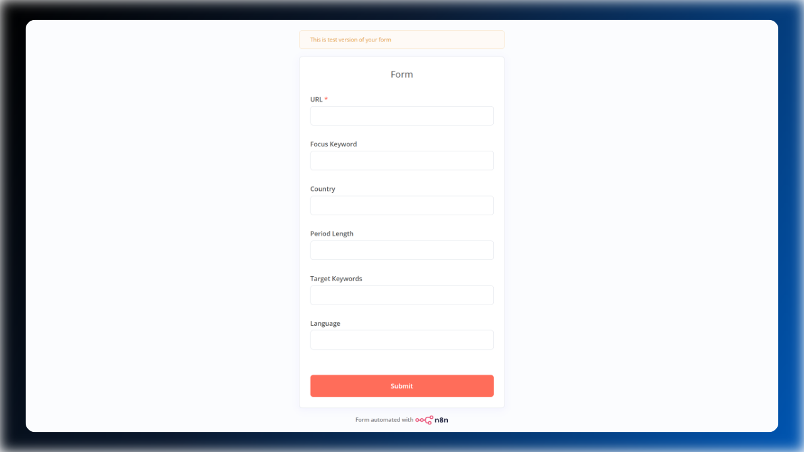
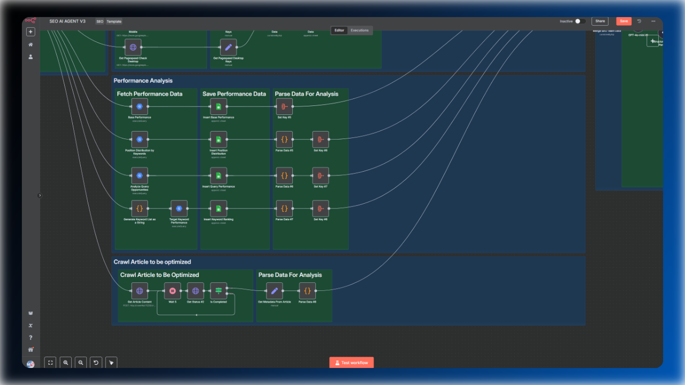
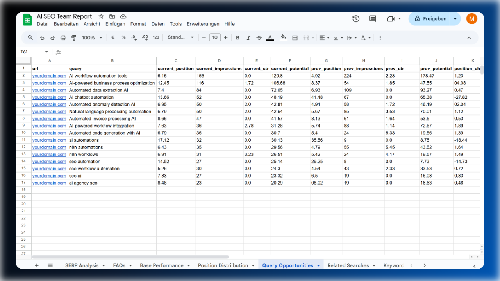
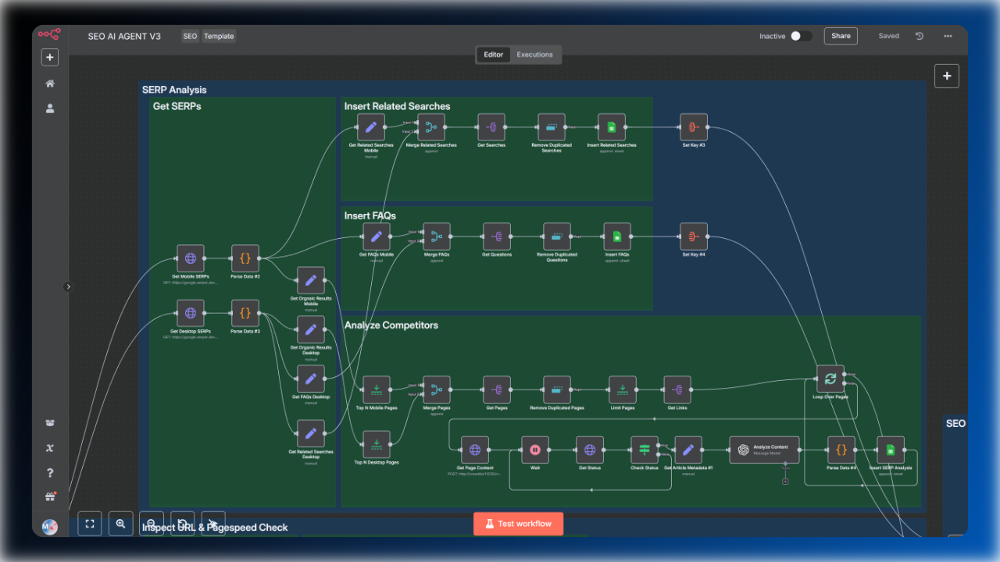
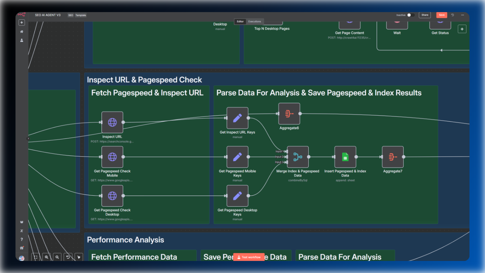

# SEO AI Agent Team – Content Optimization Workflow

**An AI-powered SEO team that keeps your website content up to date automatically, eliminating manual work. Each AI agent has its own skill set and specific tasks, generating a unique report based on your website’s performance data.**

> **[Click to learn more about the AI SEO Team](https://marvomatic.com/products/n8n-seo-ai-agent-team-content-optimization/)**

## Overview

The **SEO AI Agent Team** brings together a powerful set of multilingual AI agents to automate every step of your content optimization process. Instantly uncover keyword opportunities, competitor insights, and actionable SEO improvements. No manual data analysis required anymore.

### Key Features

- **Multilingual AI Agents:** Thanks to the AI Agent Interpreter, this workflow is able to optimize content for a global audience.
- **Fine-Tuned Prompts:** Benefit from highly reliable and consistent results, thanks to carefully engineered prompts tailored for SEO tasks.
- **Structured SEO Reports:** Receive clear, easy-to-read SEO reports that are automatically saved to Google Drive for convenient access and collaboration.
- **SERP Analysis:** Instantly analyze competitors on both mobile and desktop, uncovering actionable insights from live search results.
- **Advanced Performance Analytics:** Monitor keyword rankings, position distribution, and performance trends using customized SQL queries for BigQuery.
- **Integrations:** Seamlessly connect with BigQuery, OpenAI, Crawl4AI, Serper, and Google Drive for a streamlined, automated workflow.
- **Consistent, Actionable Results:** Advanced output parsing ensures every report is structured, deterministic, and ready to implement.
- **Simple Form**: Start the workflow by either adding a Google Sheets trigger node or using the provided form.

### What’s Inside?

**AI SEO Team:** 
Each AI agent specializes in a unique SEO task, from keyword & content optimization to technical audits, maximizing your content’s reach and effectiveness.

**Simple Form:** 
Start the workflow by adding the URL to the form, and the workflow will fetch the required optimization data from a Google spreadsheet. Alternatively, you can fill out the complete form to overwrite the existing metadata for a single optimization run, allowing you to quickly create different SEO reports.

**Advanced Performance Analytics:** 
Leverage BigQuery and Google Search Console data to track keyword rankings, position distribution, and performance trends.

**Every data analysis step will be saved into separate spreadsheets:**
From performance analysis to related searches, everything is saved in a separate spreadsheet, allowing you to analyze the data further.

**Comprehensive SERP Insights:** 
Analyze search results, competitor strategies, and common patterns across different devices.

**Pagespeed & Index Check Included:** 
Healthy Web Core Vitals and an indexed page are core aspects to check when you want to rank for a given keyword. This workflow also checks if your site is indexed and the core page speed metrics for mobile and desktop.

**Ready-to-Use SEO Reports:** 
Actionable, easy-to-read reports delivered directly to your Google Drive.

### Key Benefits

- **Save hours on research and optimization:** Automate time-consuming SEO audits and content reviews. Get actionable recommendations in minutes, not days.
- **Say goodbye to writer’s block:** Get fresh, keyword-rich content suggestions and creative alternatives for every section of your articles.
- **Data-driven decisions:** Transform raw analytics into clear, actionable insights—no more pivot tables or manual exports.

## Questions? Get in Touch Before You Buy!

If you have any questions or need clarification before purchasing, **don’t hesitate to contact me directly**. Digital products are non-refundable, so I strongly encourage you to reach out with any concerns or specific questions you may have. The more detailed your inquiry, the better I can help you determine if this workflow is the perfect fit for your needs.

**Contact me anytime via [hello@marvomatic.com](mailto:hello@marvomatic.com).**
