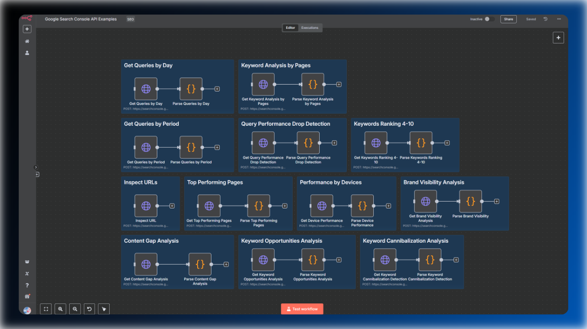

# Advanced Google Search Console Data Analysis Nodes

This n8n template leverages HTTP and code nodes as well as the Google Search Console API to deliver comprehensive SEO insights with more than 10 powerful pre-configured nodes:

## Available Nodes
The template provides ready-to-use nodes for extracting and processing SEO data:

1. **Get Queries by Day**: Extract daily keyword performance data from your GSC property.
2. **Get Queries by Period**: Analyze keyword performance across custom time ranges.
3. **Keyword Analysis by Pages**: Examine how keywords perform on individual pages.
4. **Query Performance Drop Detection**: Identify significant ranking and traffic declines.
5. **Keywords Ranking 4-10**: Monitor keywords in positions 4-10 for optimization opportunities.
6. **Inspect URLs**: Check indexing status, crawl dates, and technical SEO health.
7. **Top Performing Pages**: Identify your highest-traffic content and optimization opportunities.
8. **Performance by Devices**: Analyze mobile vs desktop search performance.
9. **Brand Visibility Analysis**: Track branded search term performance using pattern matching.
10. **Content Gap Analysis**: Discover untapped opportunities in your impression data.
11. **Keyword Opportunities Analysis**: Find high-potential keywords for content optimization.
12. **Keyword Cannibalization Analysis**: Detect internal keyword conflicts between pages.

Each node is designed for seamless integration with other automation workflows like [Keyword Rank Tracker](../keyword-rank-tracker/readme.md) or [AI SEO Writer](../gsc-ai-seo-writer/readme.md).

## Tutorial

If you have never worked with the Google Search Console API, then I would recommend to watch my tutorial on YouTube. You will learn how to create the credential, where to find the client_id, client_secret as well as the right scopes and more. You can find the tutorial [here](https://youtu.be/UPG87Wxzaf8).

## Why Is This Template Suite Useful?

If you've used my other templates, you may have noticed that I primarily use **BigQuery** for analyzing website performance. However, there are some significant limitations:

- Not everyone has activated their bulk export feature
- Even with bulk export enabled, historical data is often incomplete or missing
- BigQuery requires additional setup and Google Cloud Platform knowledge
- Many users prefer direct API access without database complexity

This template solves these issues by directly fetching performance data and inspection details from the Google Search Console API.

## Benefits

- **Free tier**: The Google Search Console API offers a free tier.
- **Comprehensive**: 12 analysis nodes in one integrated template.
- **No need for additional SEO tools**: Get accurate data directly from Google for your page.
- **Data Processing**: Built-in parsing and structuring nodes.
- **Customizable**: The template already includes the request body for the required API calls.
