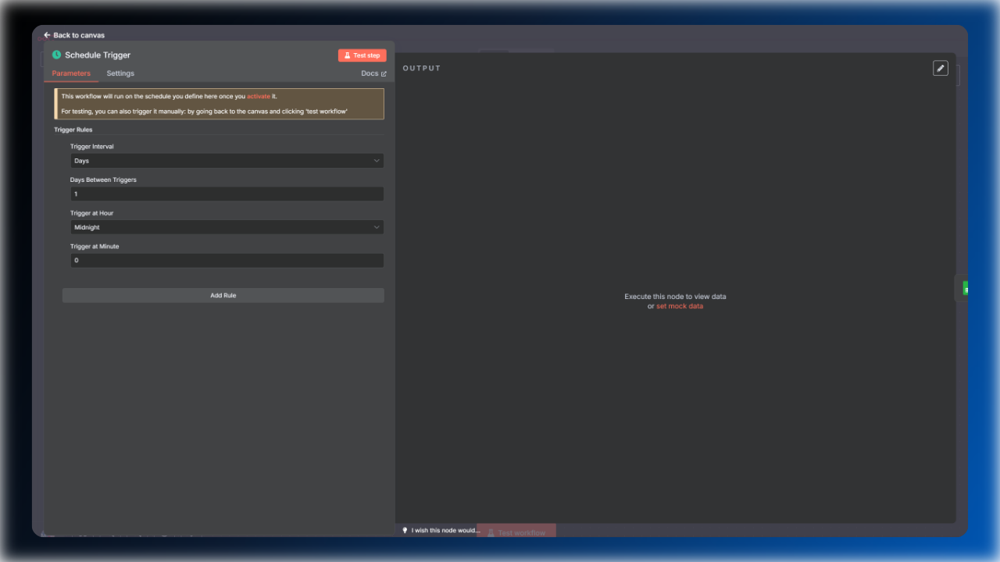

# Google Index Checker – Automated Deindexing Alerts

**Never miss a deindexed page again. This automation leverages Google Search Console’s free API to check up to 2,000 pages daily. Receive reports that help you quickly identify and fix indexing issues, ensuring your content stays visible and drives traffic.**

> **[Click to learn more about the Google Index Checker](https://marvomatic.com/products/automated-google-index-checker/)**

## Overview

The **Google Index Checker** is an n8n workflow template designed to automate the monitoring of your website's indexing status on Google. By utilizing the free tier of the Google Search Console API, this workflow checks up to 2,000 pages daily, ensuring comprehensive coverage across all your domains and sitemaps.

### Key Features

- **Unlimited Domains & Sitemaps:** Monitor as many websites and sitemap types as you need without restrictions.
- **Comprehensive Index Status Checks:** Crawl sitemap indexes and sub-sitemaps to ensure no page is left unchecked.
- **Automated Email Reports:** Receive clear, actionable reports highlighting pages that have been deindexed.
- **Proactive SEO Management:** Schedule continuous checks to catch indexing issues early and protect your site’s traffic.
- **Google Sheets Integration:** Simplify your workflow management by handling all configurations and data storage directly within Google Sheets, enhancing accessibility and collaboration.
- **Leverages Free Google API Tier:** Maximize value by efficiently using Google Search Console’s free API limits to check up to 2,000 pages daily at no cost.

### What’s Inside?

**Unlimited Domains & Sitemaps:**

**Actionable Reports Delivered Straight to Your Inbox:**
Receive clear, concise email reports highlighting pages that have lost their index status. With detailed information on sitemap, URL, last crawl time, and index verdict, quickly identify and fix SEO issues to keep the website visible and drive more organic traffic.

**Comprehensive Index Status Data at Your Fingertips:**
The workflow captures essential index metrics for every page, providing deep insights into the index status from all pages. Track coverage state, crawl times, canonical URLs, and more to identify indexing issues quickly and improve your site visibility in Google.

**Automated Scheduled Index Checks:**
Schedule the workflow to run automatically every day, ensuring no changes in site indexing status are missed. Continuous monitoring helps stay proactive, catch issues early, and maintain steady organic traffic growth.

**Automatically Submit Pages for Indexing:**
Enable the auto-indexing feature to allow the workflow to submit deindexed or unknown URLs to Google.

### Key Benefits

- **Early Detection of Deindexing:** Get regular alerts on deindexed pages for immediate action.
- **Comprehensive Data:** Reports include sitemap source, page URL, crawl time, and index status.
- **Improved Organic Traffic:** Enhance organic traffic by maintaining a healthy, fully indexed website.
- **Cost-Effective Solution:** Leverages the free tier of the Google Search Console API, making it a cost-effective solution for monitoring index status across all your domains.
- **Streamlined SEO Management:** Easily monitor the index status for multiple domains from a single n8n workflow.
- **Automated Indexing**: Automatically submit deindexed pages for re-crawling through Google’s URL Inspection API to help restore their visibility in search results.

## Questions? Get in Touch Before You Buy!

If you have any questions or need clarification before purchasing, **don’t hesitate to contact me directly**. Digital products are non-refundable, so I strongly encourage you to reach out with any concerns or specific questions you may have. The more detailed your inquiry, the better I can help you determine if this workflow is the perfect fit for your needs.

**Contact me anytime via [hello@marvomatic.com](mailto:hello@marvomatic.com).**
