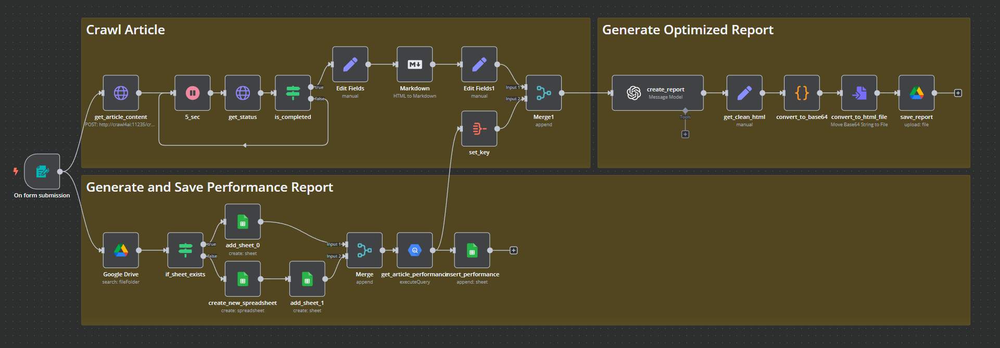

# Content Optimization Automation Template

A free n8n template to automate content optimization for blogs and websites, saving you hundreds of hours.

## Overview

This workflow is designed to streamline the process of optimizing blog posts and website content to drive organic traffic. By automating tedious tasks like keyword analysis, content rewriting, and performance tracking, this template helps you focus on creating better content while saving significant time.

## Why Is This Template Useful?

If you manage a blog or website, you know that rewriting and updating content is one of the most effective ways to boost traffic. Even small updates, like adding new keywords or rewriting a few paragraphs, can make a big difference. However, doing this manually can be time-consuming and repetitive, especially when managing multiple posts.

This template automates the entire process, from identifying high-potential keywords to generating optimized content suggestions, making it an invaluable tool for content creators.

## What Does This Template Do?

This template simplifies and automates the data-driven optimization of your articles by:

1. **Keyword Analysis**:
   - Uses a custom SQL query for BigQuery to identify useful keywords.
   - Writes keyword analysis results to a Google Sheet.

2. **Content Optimization Suggestions**:
   - Generates an HTML report with actionable suggestions, including:
     - Optimized titles
     - Improved meta descriptions
     - Overview of high-performing keywords
     - Suggestions for rewriting content, such as:
       - **Original Text**: "some text of your article"
       - **New Text**: "Text that is better optimized based on the data of your website"

3. **Performance Tracking**:
   - Checks if a Google spreadsheet exists for the article's optimization:
     - If it exists, adds a new sheet.
     - If it doesn’t exist, creates a new spreadsheet and adds a sheet.
   - Names the spreadsheet after the article's slug and the sheet after the current date, allowing you to track historical performance over time.

4. **Content Crawling and Analysis**:
   - Crawls your article using `crawl4ai` to prepare data for the LLM.
   - Generates an HTML report with optimization suggestions and saves it to your Google Drive.

## Workflow in a Nutshell

1. Enter the URL of your article in the form.
2. The workflow:
   - Fetches performance data for the URL and inserts it into Google Sheets.
   - Crawls the article and prepares data for analysis.
   - Generates an HTML report with optimization suggestions.
   - Saves the report to Google Drive.

## Benefits

- Automates tedious tasks like keyword research and content rewriting.
- Provides actionable insights to improve your content.
- Tracks historical performance for each article.
- Saves significant time and effort, allowing you to focus on creating better content.

## Important Information:
This template uses the BigQuery node and works only if you have the Bulk Data Export enabled and also BigQuery in your Google Cloud Console configured. You can either watch [this video](https://youtu.be/DlhXvS2Hsj4) or replace the BigQuery logic with [this](../get-google-search-console-data\readme.md) workflow template.
