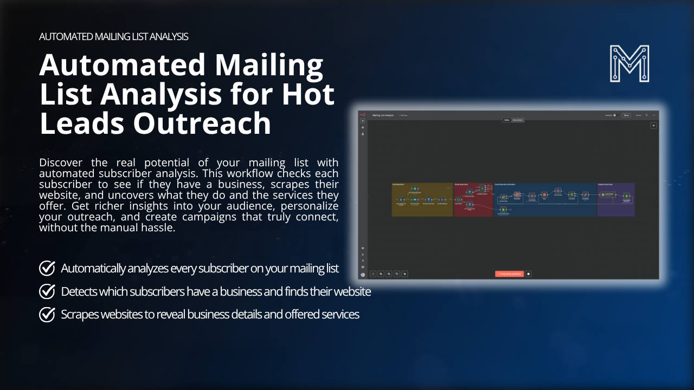
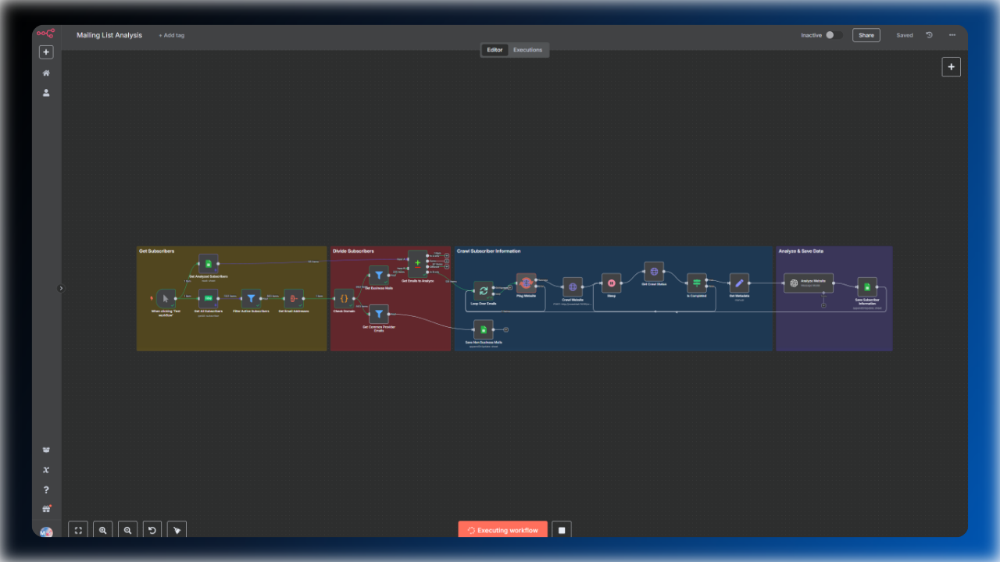
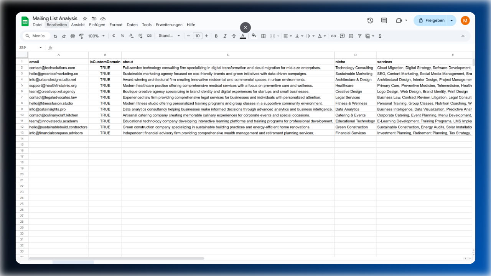

# Automated Mailing List Analysis for Hot Leads Outreach

**Unlock the hidden potential in your mailing list. This automation analyzes subscribers, identifies businesses, and scrapes their websites to uncover valuable insights for personalized outreach.**

**[Click to learn more](https://marvomatic.com/products/automated-mailing-list-analysis/)** | **[Demo](https://youtu.be/D67kp5QYRck?si=mYqxEOsdmJKRsLxi)**

## Overview

This n8n template is designed to automatically analyze your mailing list subscribers and gather useful information about them. It identifies business leads, scrapes their websites for details, and organizes all findings in a Google Spreadsheet. Powered by GPT-4o Mini, it delivers advanced insights at very low cost.

### Key Features

- **Automated Subscriber Analysis:** Effortlessly scan your entire mailing list to identify which subscribers represent businesses. No manual sorting is required.
- **Website Analysis:** Scrape each discovered website with Crawl4AI to uncover what the business does and the services they offer.
- **AI-Powered Insights:** Leverage GPT-4o Mini for smart, nuanced analysis at a lower cost than other LLMs.
- **Google Sheets Integration:** All data (email, business status, website, niche, services) is saved in a structured format for easy access and teamwork.
- **MailerLite Integration:** Seamlessly integrates with MailerLite to retrieve subscriber lists, but is adaptable to other sources.

### What’s Inside?

**n8n Workflow**

**Structured data output**

### Key Benefits

- **Identify Hot Leads:** Quickly identify potential customers by seeing their services at a glance.
- **Save Time:** Eliminate manual analysis and save valuable time.
- **Organized Data:** All key data is organized in one place for easy sharing and teamwork.
- **Cost-Effective:** Leverage advanced AI models with cost savings in mind.
- **Easy Collaboration:** Structured data allows for easy access and collaboration.

## Setup

1.  **Configure the nodes:**
    *   Update the MailerLite node with your API key.
    *   Configure the Google Sheets node with your credentials.
2.  **Create Google Sheets:**
    *   Create a spreadsheet called "Non Business Emails" with the columns "email" and "isCustomDomain".
    *   Create a spreadsheet called "Business Mails" with the columns "email", "isCustomDomain", "about", "niche", and "services".

## Recommendation
I'm using this template to better understand my audience. However, it could also be integrated into another workflow for outreach. For instance, you could adapt the prompt to gather more information about their business or even identify the person most likely to make decisions. Eventually, you can use this information to draft more effective emails than those generated by generic templates lacking context.

