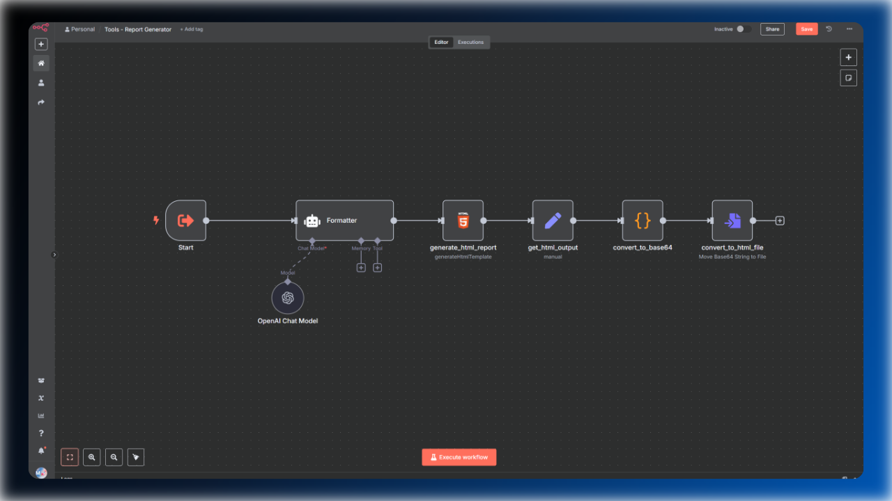
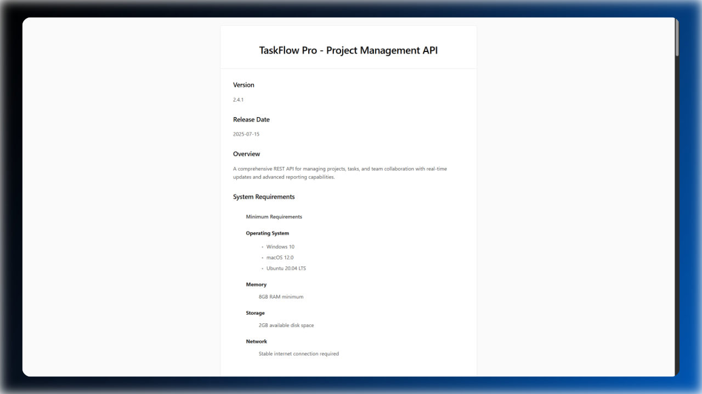

# Report Generation With n8n

This workflow converts any JSON data into a clean, styled HTML report—ready to download and share. You can find a Demo [here](https://youtu.be/OF8ykvRjdQE?si=TX3d_JXu6mWL-OyA)

# n8n Report Generator Tool

This n8n workflow transforms JSON data into beautifully formatted HTML reports. It takes structured data and converts it into professional-looking documents with proper styling and semantic HTML structure, which are also already formatted in Google Docs.

## How It Works

The workflow follows a simple 6-step process:

1. **Input** - Accepts three parameters:
   - `filename` - Name for the output file
   - `title` - Report title
   - `content` - JSON data to convert

2. **Formatting** - Uses OpenAI GPT-4.1-Mini to convert JSON structure into semantic HTML:
   - Transforms object keys into section headings
   - Converts arrays into lists
   - Maintains proper HTML hierarchy
   - Adds accessibility featuresi

3. **Template Application** - Wraps the generated content in a complete HTML template with:
   - Styling and typography
   - Responsive design for mobile/desktop
   - Clean, modern appearance

4. **File Generation** -  Converts the HTML to base64 format and creates a downloadable HTML file with the specified filename

## Example Output

Here’s what a generated report looks like:

You can find more examples [here](./report-examples).

## Key Features

- **Smart JSON Parsing**: Automatically interprets JSON structure and creates logical document sections
- **Professional Styling**: Clean, modern design with responsive layout
- **Accessibility**: Proper semantic HTML with ARIA labels
- **File Output**: Generates downloadable HTML files
- **Customizable**: Easy to modify styling and structure
