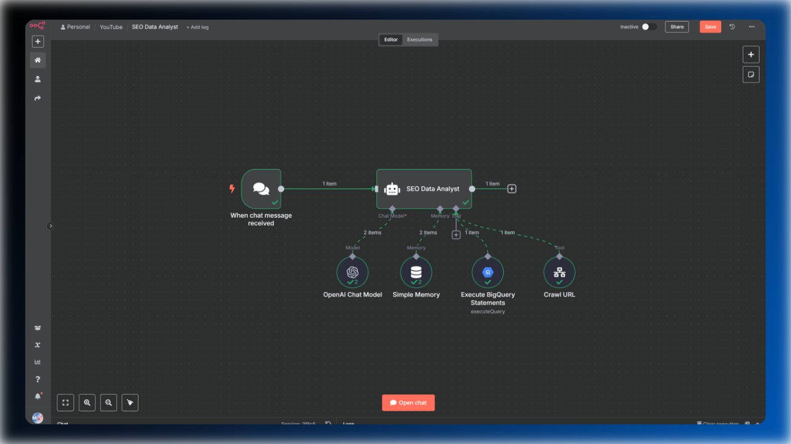
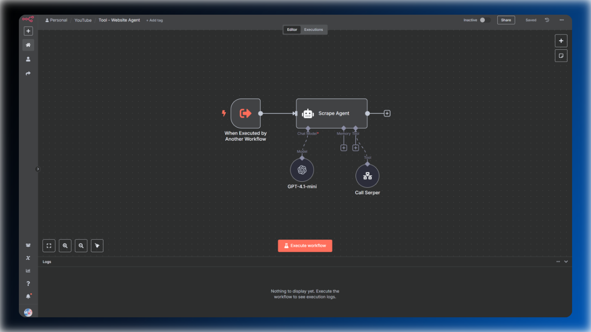
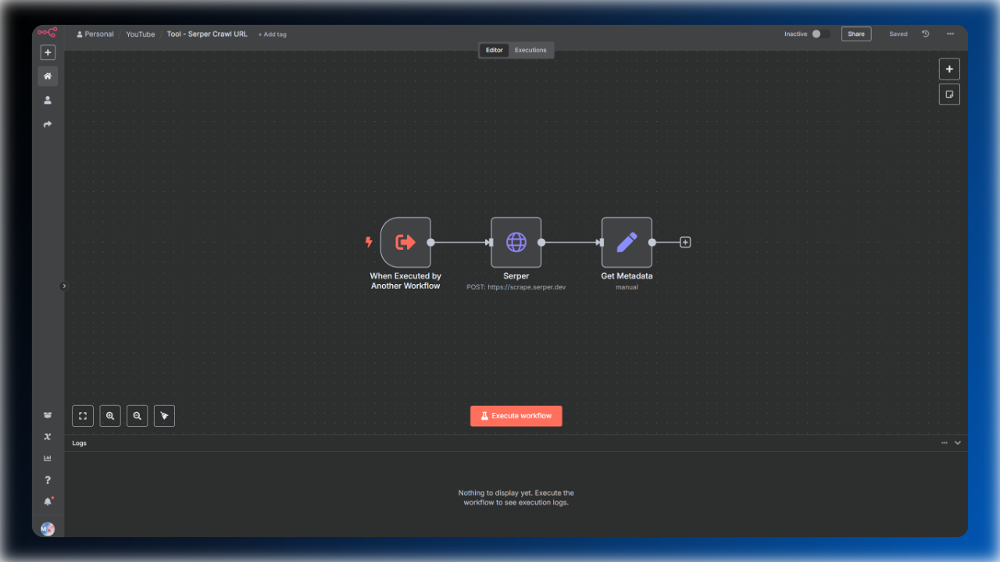

# SEO Data Analyst Agent for n8n

Improve your SEO data analysis and content optimization with this n8n workflow. This setup combines two intelligent agents and a simple content crawling workflow, enabling you to query your website’s performance data directly from BigQuery and analyze your articles interactively. 

## Overview

This workflow is designed to streamline SEO analysis by allowing you to ask natural language questions about your website’s performance. The main agent generates and executes queries on your BigQuery data, while a dedicated website agent crawls and analyzes your content. Including titles, meta descriptions, and n-gram analysis. This makes it easy to update and optimize your articles based on real data and AI-driven recommendations.

## Files & Components

### SEO Data Analyst Agent

This is the main agent you interact with. It interprets your questions, generates the necessary queries, and coordinates the analysis process.

### Website Agent

Responsible for crawling and analyzing website content. The SEO Data Analyst Agent uses this agent as a tool to fetch and process on-page data.

### Tool – Scrape Website

This workflow is used by the Website Agent to scrape content. It currently uses Serper for crawling, which is cost-effective (about €0.0017 per scrape) and easy to set up. You can easily swap Serper for Crawl4AI or Firecrawl if you prefer.

## Setup Instructions

1. **Import All Workflows** into your n8n instance.
2. **Create credentials and obtain API keys** for BigQuery, OpenAI, and Serper. For guidance, check out my tutorials on [using BigQuery and activating bulk data export in n8n](https://youtu.be/DlhXvS2Hsj4?si=0e1DSfbZQVcrvqn1) and [using the Serper Scrape Endpoint in n8n](https://youtu.be/SFI-cyoKnKs?si=9-26_XgnA5hDr41j).
3. **Update the System Prompt** in the AI Agent with your specific BigQuery table name.

**Note:** You will also find setup instructions in a sticky note within the SEO Data Analyst workflow file.

## Recommendation

I use this template whenever I want quick, ad-hoc insights without writing SQL queries myself. For a more detailed overview of your website’s performance and efficient content creation, I recommend checking out these workflows:

- [GSC AI SEO Writer](../gsc-ai-seo-writer/readme.md)
- [AI SEO Team](../ai-powered-seo-team/readme.md)
- [Website SEO Audit](../website-seo-audit/readme.md)
- [Traffic Performance Analysis](../traffic-performance-analysis/readme.md)
