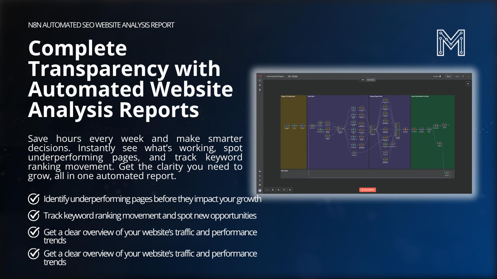
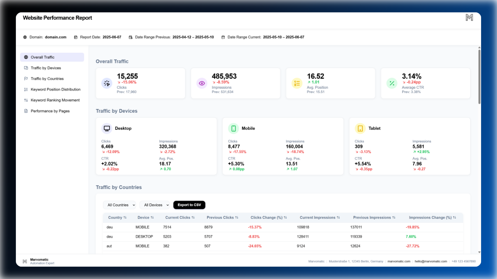
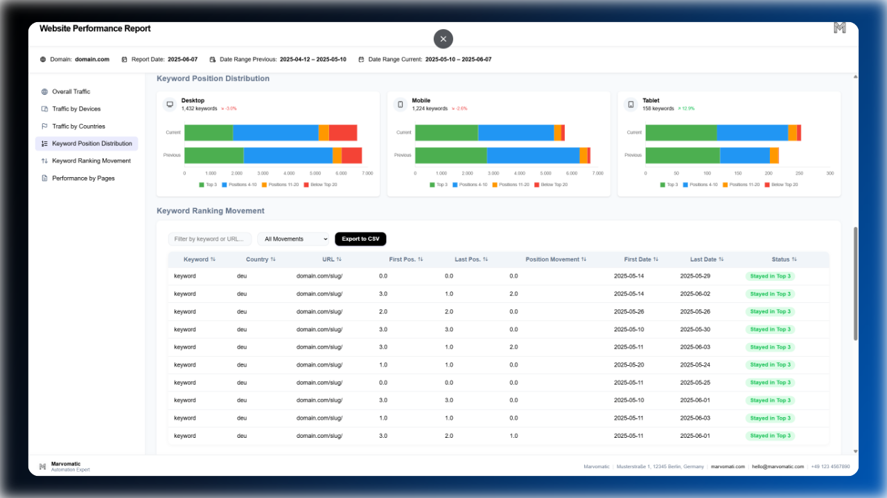
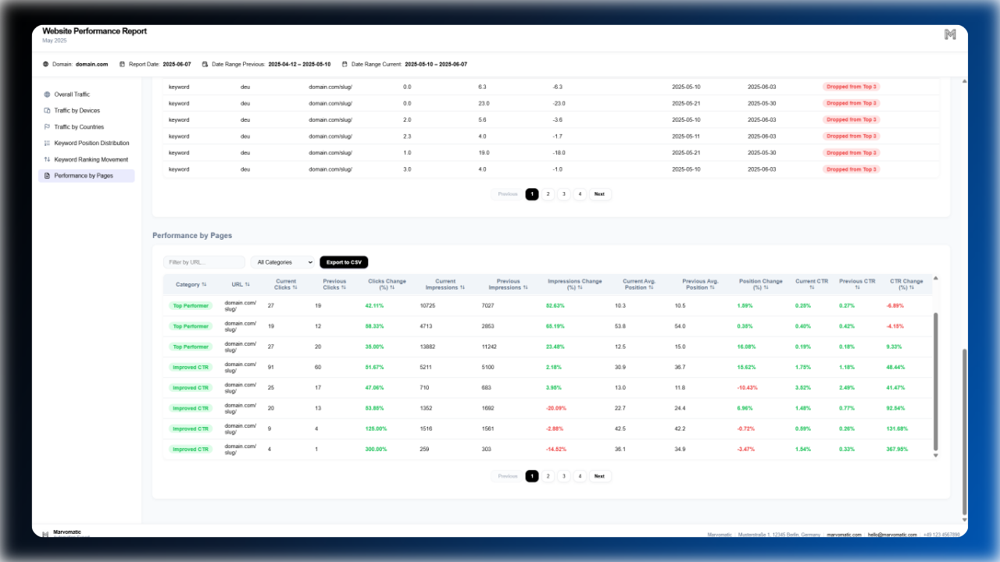
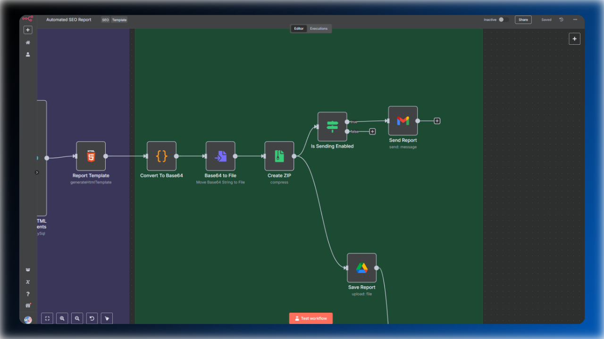

# Automated SEO Website Analysis Report – Instantly Uncover Hidden Trends

**Save hours every week and make smarter decisions with automated, actionable SEO reports. Instantly see what’s working, spot underperforming pages, and track keyword ranking movement. Everything in a single report. You can find a demo [here](https://youtu.be/_FfJLiMNJLw?si=uw7HuAxjJ-AKpPJ8).**

### [View Example Report](./website-seo-audit-report.html)
> **[Click to learn more](https://marvomatic.com/products/automated-website-analysis-report/)**

## Overview

The **Automated SEO Website Analysis Report** delivers complete transparency into your website’s performance. Effortlessly track keyword movements, identify underperforming pages, and monitor traffic trends with up-to-date, data-driven reports—no manual work required.

### Key Features

- **BigQuery Data Integration:** Get accurate, up-to-date data as the foundation for all your page analysis.
- **Keyword Movement Tracking:** Leverage BigQuery and Search Console data to monitor keyword rankings, position distribution, and performance trends over time.
- **Underperforming Pages Highlighted:** Instantly spot which pages need attention before they impact your growth.
- **Ready-to-Use SEO Insights:** Receive clear, actionable SEO reports saved directly to Google Drive for easy access and collaboration.
- **Interactive Table Filters & Export:** Quickly find what you need with table filters, then export your data in one click for deeper analysis or sharing.
- **Brand Customization:** Add your own company information as well as your brand assets.
- **Automated Report Delivery:** Set up automated delivery and get comprehensive website performance updates sent directly to your email.

### What’s Inside?

**Comprehensive Traffic Overview:**  
Get a real-time snapshot of your website’s traffic, broken down by device and country. Instantly understand where your visitors come from and how they interact with your site.

**Keyword Movement & Performance Tracking:**  
Effortlessly monitor every change in your keyword rankings. Instantly identify which keywords are rising, stable, or falling.

**Detailed Page Performance Insights:**  
See how every page on your website is performing with a detailed, filterable table. Track key metrics like category (top performer, improved CTR, stable, lower performer, declined CTR), position changes, current CTR, previous clicks, and more.

**Automated Report Delivery:**  
Stay informed without lifting a finger. Set up automated report delivery and get comprehensive website performance updates sent directly to your email. Supports multiple domains for easy client reporting.

### Key Benefits

- **Save hours on SEO audits:** Automate time-consuming website analysis and content reviews.
- **Spot opportunities and issues instantly:** Identify underperforming pages and keyword trends before they impact your growth.
- **Data-driven decisions:** Transform raw analytics into clear, actionable insights—no more manual tracking or pivot tables.
- **Easy collaboration:** Reports are saved to Google Drive and can be easily shared or exported.

## Questions? Get in Touch Before You Buy!

If you have any questions or need clarification before purchasing, **don’t hesitate to contact me directly**. Digital products are non-refundable, so please reach out with any concerns or specific questions.

**Contact: [hello@marvomatic.com](mailto:hello@marvomatic.com)**

